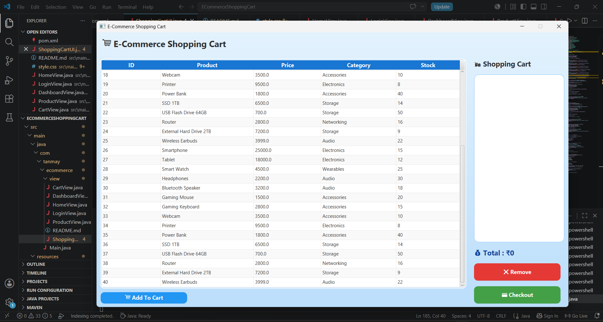
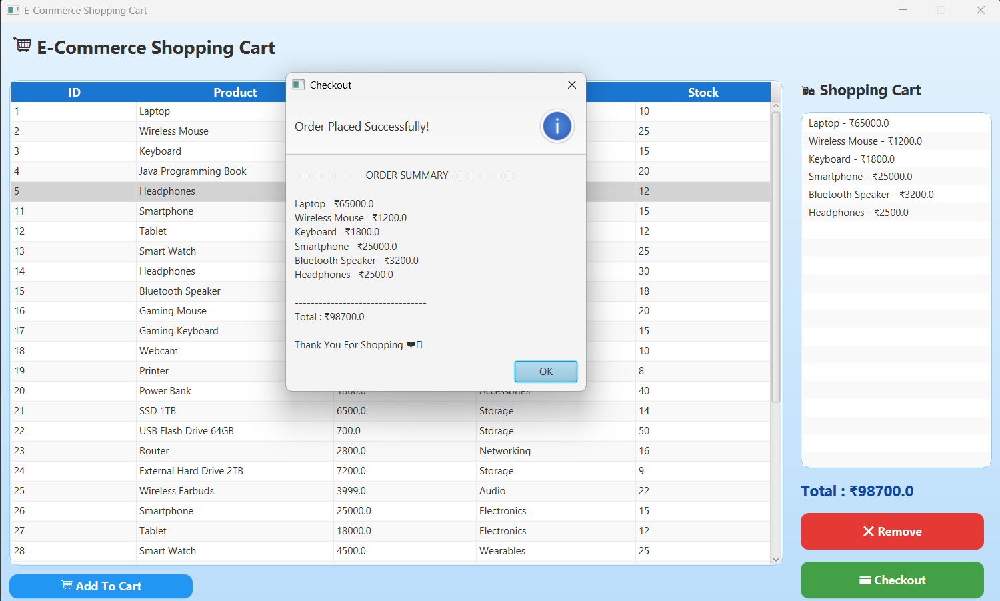

# 🛒 E-Commerce Shopping Cart

A JavaFX-based desktop application that simulates an online shopping cart system. The application allows users to browse products from a MySQL database, add items to the cart, remove products, calculate the total amount, and complete the checkout process with an order summary.

---

## 📸 Project Preview





---

## ✨ Features

- 🛍️ Display products from MySQL database
- ➕ Add products to shopping cart
- ➖ Remove products from shopping cart
- 💰 Automatic total price calculation
- 💳 Checkout with order summary
- ⚠️ Warning alerts for invalid actions
- 🎨 JavaFX desktop GUI with CSS styling
- 📦 Maven project structure
- 🗄️ MySQL database integration
- 🧩 DAO (Data Access Object) design pattern

---

## 🛠️ Technologies Used

- Java 17
- JavaFX
- Maven
- MySQL
- JDBC
- CSS
- VS Code

---

## 📂 Project Structure

```
ECommerceShoppingCart
│── src
│   ├── main
│   │   ├── java
│   │   │   └── com.tanmay.ecommerce
│   │   │       ├── dao
│   │   │       ├── database
│   │   │       ├── model
│   │   │       ├── view
│   │   │       └── Main.java
│   │   └── resources
│   │       └── style.css
│── pom.xml
│── README.md
```

---

## 🚀 How to Run

### Clone the Repository

```bash
git clone https://github.com/YOUR_USERNAME/ECommerceShoppingCart.git
```

### Open the Project

Open the project in **VS Code** or **IntelliJ IDEA**.

### Configure Database

Create a MySQL database named:

```
ecommerce_db
```

Create the `products` table and insert sample product records.

Update your database credentials inside:

```
DatabaseConnection.java
```

### Run the Project

```bash
mvn javafx:run
```

---

## 📷 Screenshots

### 🏠 Home Screen

> *(Add Screenshot Here)*

---

### 🛒 Shopping Cart

> *(Add Screenshot Here)*

---

### 💳 Checkout

> *(Add Screenshot Here)*

---

## 🎯 Future Enhancements

- 🔍 Product Search
- 📂 Category Filter
- 📦 Product Quantity
- 📉 Stock Management
- 🧾 Invoice Generation
- 🌙 Dark Mode

---

## 👨‍💻 Author

**Tanmay Shrivastava**

B.Tech CSE (AI & Data Science)

GLA University, Mathura

---

## ⭐ Support

If you like this project, don't forget to **Star ⭐ the repository**.